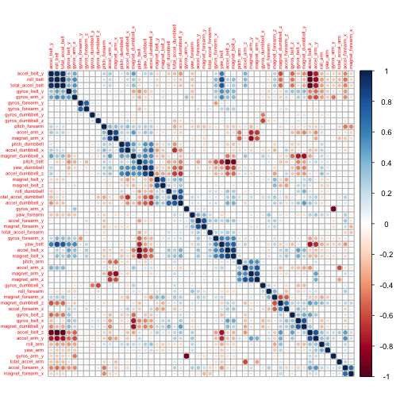
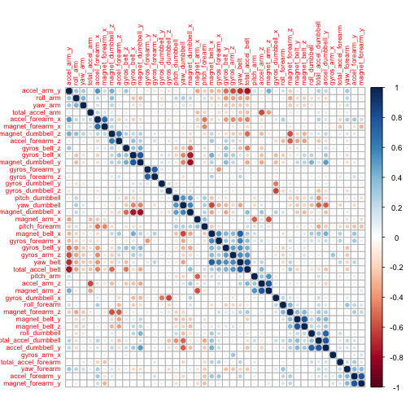

# Predictive Model For Fitness Exercise Correctness

## Background
Using devices such as Jawbone Up, Nike FuelBand, and Fitbit it is now possible to collect a large amount of data about personal activity relatively inexpensively. These type of devices are part of the quantified self movement – a group of enthusiasts who take measurements about themselves regularly to improve their health, to find patterns in their behavior, or because they are tech geeks. One thing that people regularly do is quantify how much of a particular activity they do, but they rarely quantify how well they do it. In this project, our goal will be to use data from accelerometers on the belt, forearm, arm, and dumbell of 6 participants. They were asked to perform barbell lifts correctly and incorrectly in 5 different ways. More information is available from the website here: <a href="http://groupware.les.inf.puc-rio.br/har">http://groupware.les.inf.puc-rio.br/har</a> (see the section on the Weight Lifting Exercise Dataset). 

## Objective
The goal is to predict the manner in which they did the exercise. This is the "classe" variable in the training set. We will find any of the other variables to predict with. In this report, we describe how we build the predictive model, how we use cross validation, what the expected out of sample error is, and why the choices we did.

## Data Processing

### Retrieve Data
Let's download and read the training data from <a href=""http://d396qusza40orc.cloudfront.net/predmachlearn/pml-training.csv">http://d396qusza40orc.cloudfront.net/predmachlearn/pml-training.csv</a> as follow.

```r
if (!file.exists("./pml-training.csv")) {
    download.file("http://d396qusza40orc.cloudfront.net/predmachlearn/pml-training.csv", 
        destfile = "./pml-training.csv")
}
pml.training <- read.csv("./pml-training.csv")
dim(pml.training)
```

```
## [1] 19622   160
```


### Clean Data
Quick look at predictors:

```r
names(pml.training)
```

```
##   [1] "X"                        "user_name"               
##   [3] "raw_timestamp_part_1"     "raw_timestamp_part_2"    
##   [5] "cvtd_timestamp"           "new_window"              
##   [7] "num_window"               "roll_belt"               
##   [9] "pitch_belt"               "yaw_belt"                
##  [11] "total_accel_belt"         "kurtosis_roll_belt"      
##  [13] "kurtosis_picth_belt"      "kurtosis_yaw_belt"       
##  [15] "skewness_roll_belt"       "skewness_roll_belt.1"    
##  [17] "skewness_yaw_belt"        "max_roll_belt"           
##  [19] "max_picth_belt"           "max_yaw_belt"            
##  [21] "min_roll_belt"            "min_pitch_belt"          
##  [23] "min_yaw_belt"             "amplitude_roll_belt"     
##  [25] "amplitude_pitch_belt"     "amplitude_yaw_belt"      
##  [27] "var_total_accel_belt"     "avg_roll_belt"           
##  [29] "stddev_roll_belt"         "var_roll_belt"           
##  [31] "avg_pitch_belt"           "stddev_pitch_belt"       
##  [33] "var_pitch_belt"           "avg_yaw_belt"            
##  [35] "stddev_yaw_belt"          "var_yaw_belt"            
##  [37] "gyros_belt_x"             "gyros_belt_y"            
##  [39] "gyros_belt_z"             "accel_belt_x"            
##  [41] "accel_belt_y"             "accel_belt_z"            
##  [43] "magnet_belt_x"            "magnet_belt_y"           
##  [45] "magnet_belt_z"            "roll_arm"                
##  [47] "pitch_arm"                "yaw_arm"                 
##  [49] "total_accel_arm"          "var_accel_arm"           
##  [51] "avg_roll_arm"             "stddev_roll_arm"         
##  [53] "var_roll_arm"             "avg_pitch_arm"           
##  [55] "stddev_pitch_arm"         "var_pitch_arm"           
##  [57] "avg_yaw_arm"              "stddev_yaw_arm"          
##  [59] "var_yaw_arm"              "gyros_arm_x"             
##  [61] "gyros_arm_y"              "gyros_arm_z"             
##  [63] "accel_arm_x"              "accel_arm_y"             
##  [65] "accel_arm_z"              "magnet_arm_x"            
##  [67] "magnet_arm_y"             "magnet_arm_z"            
##  [69] "kurtosis_roll_arm"        "kurtosis_picth_arm"      
##  [71] "kurtosis_yaw_arm"         "skewness_roll_arm"       
##  [73] "skewness_pitch_arm"       "skewness_yaw_arm"        
##  [75] "max_roll_arm"             "max_picth_arm"           
##  [77] "max_yaw_arm"              "min_roll_arm"            
##  [79] "min_pitch_arm"            "min_yaw_arm"             
##  [81] "amplitude_roll_arm"       "amplitude_pitch_arm"     
##  [83] "amplitude_yaw_arm"        "roll_dumbbell"           
##  [85] "pitch_dumbbell"           "yaw_dumbbell"            
##  [87] "kurtosis_roll_dumbbell"   "kurtosis_picth_dumbbell" 
##  [89] "kurtosis_yaw_dumbbell"    "skewness_roll_dumbbell"  
##  [91] "skewness_pitch_dumbbell"  "skewness_yaw_dumbbell"   
##  [93] "max_roll_dumbbell"        "max_picth_dumbbell"      
##  [95] "max_yaw_dumbbell"         "min_roll_dumbbell"       
##  [97] "min_pitch_dumbbell"       "min_yaw_dumbbell"        
##  [99] "amplitude_roll_dumbbell"  "amplitude_pitch_dumbbell"
## [101] "amplitude_yaw_dumbbell"   "total_accel_dumbbell"    
## [103] "var_accel_dumbbell"       "avg_roll_dumbbell"       
## [105] "stddev_roll_dumbbell"     "var_roll_dumbbell"       
## [107] "avg_pitch_dumbbell"       "stddev_pitch_dumbbell"   
## [109] "var_pitch_dumbbell"       "avg_yaw_dumbbell"        
## [111] "stddev_yaw_dumbbell"      "var_yaw_dumbbell"        
## [113] "gyros_dumbbell_x"         "gyros_dumbbell_y"        
## [115] "gyros_dumbbell_z"         "accel_dumbbell_x"        
## [117] "accel_dumbbell_y"         "accel_dumbbell_z"        
## [119] "magnet_dumbbell_x"        "magnet_dumbbell_y"       
## [121] "magnet_dumbbell_z"        "roll_forearm"            
## [123] "pitch_forearm"            "yaw_forearm"             
## [125] "kurtosis_roll_forearm"    "kurtosis_picth_forearm"  
## [127] "kurtosis_yaw_forearm"     "skewness_roll_forearm"   
## [129] "skewness_pitch_forearm"   "skewness_yaw_forearm"    
## [131] "max_roll_forearm"         "max_picth_forearm"       
## [133] "max_yaw_forearm"          "min_roll_forearm"        
## [135] "min_pitch_forearm"        "min_yaw_forearm"         
## [137] "amplitude_roll_forearm"   "amplitude_pitch_forearm" 
## [139] "amplitude_yaw_forearm"    "total_accel_forearm"     
## [141] "var_accel_forearm"        "avg_roll_forearm"        
## [143] "stddev_roll_forearm"      "var_roll_forearm"        
## [145] "avg_pitch_forearm"        "stddev_pitch_forearm"    
## [147] "var_pitch_forearm"        "avg_yaw_forearm"         
## [149] "stddev_yaw_forearm"       "var_yaw_forearm"         
## [151] "gyros_forearm_x"          "gyros_forearm_y"         
## [153] "gyros_forearm_z"          "accel_forearm_x"         
## [155] "accel_forearm_y"          "accel_forearm_z"         
## [157] "magnet_forearm_x"         "magnet_forearm_y"        
## [159] "magnet_forearm_z"         "classe"
```

We remove columns user_name, raw_timestamp_part_1, raw_timestamp_part_2, cvtd_timestamp, new_window and num_window:

```r
pml.training <- subset(pml.training, select = -c(X, user_name, raw_timestamp_part_1, 
    raw_timestamp_part_2, cvtd_timestamp, new_window, num_window))
dim(pml.training)
```

```
## [1] 19622   153
```

Let's remove columns filled with NAs

```r
pml.training <- pml.training[, complete.cases(t(pml.training))]
dim(pml.training)
```

```
## [1] 19622    86
```


### Pre-Process Data
We now split the updated training dataset into a training dataset (70% of the observations) and a validation dataset (30% of the observations).

```r
library(caret)
```

```
## Loading required package: lattice
## Loading required package: ggplot2
```

```r
inTrain = createDataPartition(y = pml.training$classe, p = 0.7, list = FALSE)
small_train = pml.training[inTrain, ]
small_valid = pml.training[-inTrain, ]
dim(small_train)
```

```
## [1] 13737    86
```

(1) Let's remove near zero covariates

```r
library(caret)
aux <- nearZeroVar(small_train, saveMetrics = TRUE)
filter <- subset(aux, aux$nzv == FALSE)
small_train <- small_train[, rownames(filter)]
dim(small_train)
```

```
## [1] 13737    53
```

(2) We can see from below the highly correlated covariates

```r
library(corrplot)
sub <- subset(small_train, select = -classe)
pred.corr <- cor(sub[sapply(sub, is.numeric)])
corrplot(pred.corr, order = "hclust", tl.cex = 0.5)
```

 

(3) Let's filter out the highly correlated covariates

```r
highlyCor <- findCorrelation(pred.corr, 0.8)
filtered <- sub[, -highlyCor]
corData <- cor(filtered)
corrplot(corData, order = "hclust", tl.cex = 0.7)
```

 

(4) We apply to our training data

```r
var <- c(names(filtered), "classe")
small_train <- small_train[, var]
dim(small_train)
```

```
## [1] 13737    43
```


### Predictive Model
Next, we train a model using a random forest approach on the smaller training dataset.

```r
library(randomForest)
```

```
## randomForest 4.6-7
## Type rfNews() to see new features/changes/bug fixes.
```

```r
model <- randomForest(classe ~ ., data = small_train)
model
```

```
## 
## Call:
##  randomForest(formula = classe ~ ., data = small_train) 
##                Type of random forest: classification
##                      Number of trees: 500
## No. of variables tried at each split: 6
## 
##         OOB estimate of  error rate: 0.63%
## Confusion matrix:
##      A    B    C    D    E class.error
## A 3904    2    0    0    0    0.000512
## B   13 2633   12    0    0    0.009406
## C    0   22 2370    4    0    0.010851
## D    0    0   24 2224    4    0.012433
## E    0    0    1    4 2520    0.001980
```

The confusion matrix indicates the model fits the training set well.

```r
model$confusion
```

```
##      A    B    C    D    E class.error
## A 3904    2    0    0    0    0.000512
## B   13 2633   12    0    0    0.009406
## C    0   22 2370    4    0    0.010851
## D    0    0   24 2224    4    0.012433
## E    0    0    1    4 2520    0.001980
```


### Cross Validation


```r
small_valid <- small_valid[, var]
accurate <- c(as.numeric(predict(model, newdata = small_valid[, -ncol(small_valid)]) == 
    small_valid$classe))
accuracy <- sum(accurate) * 100/nrow(small_valid)
message("Model Accuracy as tested over Validation set = ", format(round(accuracy, 
    2), nsmall = 2), "%")
```

```
## Model Accuracy as tested over Validation set = 99.29%
```


### Predicted Results

We download the testing data set

```r
if (!file.exists("./pml-testing.csv")) {
    download.file("http://d396qusza40orc.cloudfront.net/predmachlearn/pml-testing.csv", 
        destfile = "./pml-testing.csv")
}
pml.testing <- read.csv("./pml-testing.csv")
```

We subset to the right covariates and run the predictions with our model.

```r
proc.pml.testing <- pml.testing[, names(filtered)]
predict(model, proc.pml.testing)
```

```
##  1  2  3  4  5  6  7  8  9 10 11 12 13 14 15 16 17 18 19 20 
##  B  A  B  A  A  E  D  B  A  A  B  C  B  A  E  E  A  B  B  B 
## Levels: A B C D E
```

```
